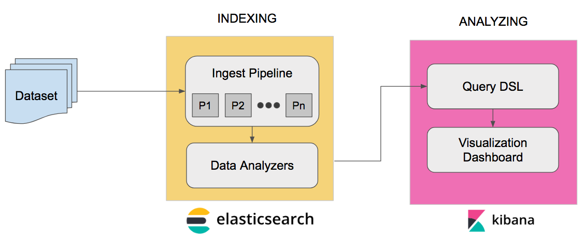

## Online Mental Disorder Analysis with Elasticsearch and Kibana
---

### Project Summary

In this presentation ([slide available here](https://docs.google.com/presentation/d/1-FG3lpEptywAKFqQIH45cRDiZ0papB7V6BW7KPB37Ao/edit?usp=sharing)), I provide a basic analysis and feature engineering pipeline to discover interesting and hidden linguistic phenomena and emotional behaviors of online mental disorder users. The first phase of the analysis focus on exploring basic linguistic and social cues such as emoticons, stopwords, hashtags, social mentions, etc. The goals of the presentation are the following:

- To broadly show how to leverage Elasticsearch's ingest pipeline and custom analyzers for preprocessing and feature engineering
- To introduce common best practices for dealing with natural language data
- To discover insights that assist to improve feature engineering and ML models

### Prerequisites
To fully understand the material in this project, it assumes basic knowledge of Elasticsearch and Python. The Elastic [learning page](https://www.elastic.co/learn) and [official reference](https://www.elastic.co/guide/en/elasticsearch/reference/current/full-text-queries.html) are great places to start learning about Elasticsearch and Kibana.

### Requirements
Below are the requirements for this project:
- Install [Elasticsearch 6.6](https://www.elastic.co/downloads/elasticsearch)
- Install [Kibana 6.6](https://www.elastic.co/downloads/kibana)
- [Jupyter](https://jupyter.org/) (with Python 3.6)
- [Elasticsearch python module](https://elasticsearch-py.readthedocs.io/en/master/)

### Framework
In this project, I show how to insert the data discussed above into Elasticsearch to be able to conduct interesting featuring engineering and anlysis using Kibana and the developer tools. I make heavy use of the ingest pipeline to define processors through which the data will be fed before being indexed (stored) into Elasticsearch via the bulk API using `elasticsearch` [Python module](https://elasticsearch-py.readthedocs.io/en/master/). The code ([notebook](https://github.com/omarsar/clinical_nlp_elastic/blob/master/01-1-exporting-to-elastic.ipynb)) used to perform the bulk insert can be found in this repository.

### Data
The participants used in this analysis are collected from Twitter based on their self-reported status. The self-reported mental disorder cases were collected via a filter, "I am diagnosed with X". I only focus on bipolar disorder and borderline personality disorder self-reported cases. A seperate control group was randomly collected using the Twitter public API. All cases were manually verified and checked for data quality control. More information on how to collect such dataset can be found in this [paper](https://ieeexplore.ieee.org/document/7752434).  

There are some ethical concerns about publicly sharing the dataset so if you are seriously interested in using it for research purposes please feel free to reach out to me at ellfae@gmail.com. There is an [alternative dataset](http://takelab.fer.hr/data/bipolar) (collected from Reddit), similar to this one, that can also be obtained in a similar process. Ideally, it doesn't matter what dataset we are using, the goal is to provide a framework that can perform the analysis on various kinds of datasets coming from different sources. 

### Dashboard
The visualization dashboard built using Kibana looks as follows:

### Other Resources
The full presentation slides accomponying this project can be found [here](https://docs.google.com/presentation/d/1-FG3lpEptywAKFqQIH45cRDiZ0papB7V6BW7KPB37Ao/edit?usp=sharing)

### Project Status
- Phase 1 - Proposal of indexing, feature engineering, and analytics ([read more](https://medium.com/dair-ai/mental-disorder-analysis-with-elasticsearch-and-kibana-phase-1-36021f424f06))
- Phase 2 (Coming soon!) - More details on project, models, data, research, etc. 

### Future Ideas
- Create sample data to reproduce experiments and analyses
- General NLP pipeline for mental disorder analysis and text analytics
- Integrate logstash for gathering, processing, and indexing more cases
- Build a machine learning or deep learning dedicated API to automatically perform prediction of new mental disorder cases

### Contact Information
- [Elvis Saravia](https://twitter.com/omarsar0)
- [Google Profile](https://scholar.google.com.tw/citations?user=GTU6jHcAAAAJ&hl=en)
- [Medium](https://medium.com/@ibelmopan)
- [Website](http://elvissaravia.com/)

